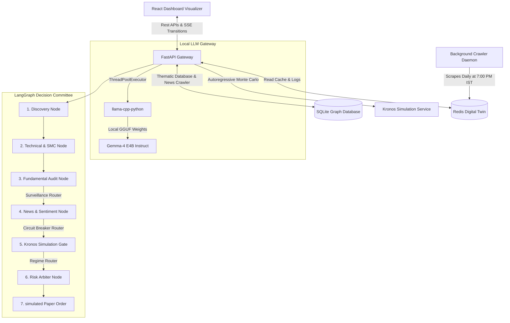

# Echo: Multi-Agent Investment Committee & Screener for Indian Equities

Echo is an institutional-grade, automated stock screening and real-time risk visualization platform designed specifically for the Indian Equity Markets (BSE/NSE). 

Echo merges **Warren Buffett / Benjamin Graham Value & Moat Quality** fundamentals with **Stan Weinstein / William O'Neil Breakout Momentum** and **Wyckoff / Smart Money Concepts (SMC)** structural price sweeps. Orchestrated with **LangGraph**, it runs a background crawler that caches candidate states in a Redis Digital Twin, serving a high-fidelity Bloomberg-style dashboard with beginner-friendly tooltips and entry timing assessments.

---

## 1. System Architecture



---

## 2. Exhaustive Feature Index & Implementation Details

### A. Local Gemma-4 GGUF Gateway (`llm_gateway.py`)
To ensure total data privacy, avoid external API token costs, and maintain zero cold-start latency on Hugging Face Spaces, Echo runs LLM queries entirely locally.
* **Model Loader**: Implements a `LocalLLMEngine` class that lazy-loads `google_gemma-4-E4B-it-Q4_K_M.gguf` (Instruct model) via `llama-cpp-python`.
* **Non-Blocking Inference**: Runs the CPU inference inside a Python `ThreadPoolExecutor` (via `asyncio.get_event_loop().run_in_executor`). This ensures that during heavy inference cycles, the FastAPI async event loop is never blocked and remains fully responsive.
* **Gemma Turn Formatting**: Wraps prompts in the standard Gemma turn tokens:
  ```
  <|turn>system
  {system_instruction} <turn|>
  <|turn>user
  {prompt} <turn|>
  <|turn>model
  ```
* **Thought Stripping**: Uses regex parsing (`re.sub(r'<\|channel>thought.*?<channel\|>', '', text, flags=re.DOTALL)`) to strip Gemma's internal thinking blocks from the output, returning only the parsed result.

---

### B. Persistent & Self-Updating Thematic Engine (`thematic_engine.py` & `thematic_db.py`)
This module automates the process of mapping top-down policy catalysts (e.g. government defense allocations or railway expansions) to listed Indian monopolies/duopolies that supply the raw materials.

1. **Lightweight SQLite Graph Store**:
   - The knowledge graph is persisted in a local SQLite database (`thematic_knowledge_graph.db`) located in the persistent `/data` directory (Hugging Face Spaces) or `backend/data_store/` (locally).
   - **Schema**:
     - `nodes`: Represents entities like companies, sectors, or products.
       - `id` TEXT PRIMARY KEY (e.g. `"SOLARINDS.NS"`, `"DEFENSE"`)
       - `type` TEXT (e.g. `"COMPANY"`, `"THEME"`, `"PRODUCT"`)
       - `label` TEXT (e.g. `"Solar Industries India"`)
       - `description` TEXT
     - `edges`: Represents relationship links.
       - `id` INTEGER PRIMARY KEY AUTOINCREMENT
       - `source_id` TEXT (Company Symbol)
       - `target_id` TEXT (Theme Node ID)
       - `relation_type` TEXT (e.g. `"SUPPLIES_SECTOR"`, `"CONTRACT_WIN"`)
       - `weight` REAL (Contract Value in Crores or relevance weight)
       - `role` TEXT (Details of the supply role or contract text)
       - `pricing_power` TEXT (e.g. "High", "Medium")
       - `catalyst_relevance` TEXT
       - `timestamp` INTEGER (Unix epoch)
       - FOREIGN KEY(source_id) REFERENCES nodes(id) ON DELETE CASCADE
       - FOREIGN KEY(target_id) REFERENCES nodes(id) ON DELETE CASCADE
       - UNIQUE(source_id, target_id, relation_type)
   - Supports cascading deletes (deleting a node removes all connected edges) and table indices on `source_id`, `target_id`, and `timestamp` for sub-millisecond retrieval.

2. **Autonomous Order-Win News Crawler (Tier 1 & 2)**:
   - Scrapes Google News search RSS feeds for Indian corporate announcements containing keywords: `order win`, `wins contract`, `awarded contract`, `secures deal`, `crore`.
   - Parses the RSS XML feed to extract headlines, summaries, and publication dates.
   - Feeds the filtered news text to the local Gemma-4 model to perform entity extraction, converting unstructured headlines into a structured JSON:
     ```json
     {
       "is_order_win": true,
       "company_name": "Premier Explosives",
       "theme": "DEFENSE",
       "products_or_materials": ["Solid Propellants", "Explosives"],
       "estimated_budget_cr": 550.0
     }
     ```

3. **Dynamic Company Ticker Resolver**:
   - Downloads the official Nifty 500 constituents metadata dynamically from the NSE archives (`ind_nifty500list.csv`).
   - Cleans the raw company names (stripping suffixes like "Ltd", "Limited", "India", "Systems") and performs exact, substring, and token-overlap scoring to resolve raw names (e.g., "Titagarh Rail") to yfinance-compatible ticker symbols (e.g., `"TITAGARH.NS"`).
   - Automatically writes resolved companies and their contract wins as nodes and edges into the SQLite database.

4. **Catalyst Forgetting Protocol (TTL)**:
   - To prevent the system from bias based on outdated announcements, contract win relationships contain a `timestamp`. A background routine dynamically runs:
     `DELETE FROM edges WHERE relation_type = 'CONTRACT_WIN' AND timestamp < (current_time - 180 days)`.
   - Explicit cascading hard-deletion is enforced when deleting a node or edge via the REST API.

5. **Data Anomaly Sanity Filters**:
   - **Zero/Negative Price Filter**: Filters out and ignores daily close prices $\le 0$.
   - **Volume Anomaly Check**: Flags warning logs if daily volume is 0 on active days, preventing division-by-zero errors.
   - **Outlier Price check**: Inspects daily percent changes. If any day-on-day price shift exceeds $>100\%$, it logs a data corruption warning and flags the anomaly status.

6. **Smart Money Verification (OBV)**:
   - Calculates On-Balance Volume (OBV) and its 20-day EMA (`obv_ema20`) to verify institutional accumulation.
     $$\text{OBV}_t = \text{OBV}_{t-1} + \text{Volume}_t \quad (\text{if } \text{Close}_t > \text{Close}_{t-1})$$
     $$\text{OBV}_t = \text{OBV}_{t-1} - \text{Volume}_t \quad (\text{if } \text{Close}_t < \text{Close}_{t-1})$$
     $$\text{OBV}_t = \text{OBV}_{t-1} \quad (\text{if } \text{Close}_t = \text{Close}_{t-1})$$
   - *Accumulation* is flagged if OBV is higher than its 20-day EMA and is rising over a rolling 10-day period.

7. **Catalyst Exhaustion Filter (Risk)**:
   - Checks if the supplier's price has already rallied $\ge 50\%$ in the last 90 trading days. If it has, the engine flags it as **"Do Not Buy - Catalyst Exhausted"** to prevent buying at distribution tops where insiders dump shares post-announcement.

8. **Contract Impact Ratio**:
   - Calculates the ratio of the budget size to the supplier's market cap:
     $$\text{Impact \%} = \left(\frac{\text{Budget in Crores}}{\text{Market Cap in Crores}}\right) \times 100$$
     A higher ratio indicates that the catalyst represents a material percentage of the company's total value, raising conviction.

9. **Thematic REST Management APIs**:
   - `GET /api/thematic/graph`: Retrieves the entire node-link graph data structure.
   - `POST /api/thematic/node`: Adds/updates a node in SQLite.
   - `DELETE /api/thematic/node/{node_id}`: Cascading deletion of a node and its edges.
   - `POST /api/thematic/edge`: Adds/updates a relationship edge in SQLite.
   - `DELETE /api/thematic/edge/{edge_id}`: Deletes a specific relationship edge.
   - `POST /api/thematic/crawl`: Manually trigger the Google News RSS crawler and Gemma classification pipeline.

---

### C. Playwright Compliance & Flows Crawler (`screener_daemon.py`)
* **SEBI Surveillance Watchlists**: To prevent trapping capital in illiquid segments, the crawler uses Playwright to launch a headless Chromium instance, navigate to the official NSE Reports page (`https://www.nseindia.com/reports/adr-res-surveillance-measure`), and parse dynamic tables. Tickers are automatically scraped and loaded into the compliance gatekeeper under **ASM** (Additional Surveillance Measure), **GSM** (Graded Surveillance Measure), and **T2T** (Trade-to-Trade) categories.
* **Institutional Flows Scraper**: Playwright sequentially scrapes FII/DII cash activity tables from three fallback sources: NiftyTrader, Moneycontrol, and StockEdge. It uses a semantic table parser to extract net daily values, converting formatting like negative wicks `(1,234.50)` into floats.

---

### D. SEBI 2026 Algorithmic Compliance Gates (`surveillance_compliance.py`)
Echo enforces strict regulatory guardrails:
* **Leaky-Bucket Rate Limiter**: Ensures order placement rate stays under 9 Orders Per Second (OPS) to prevent being classified as high-frequency trading (HFT).
* **Market Price Protection (MPP)**: Blocks naked market orders. They are rewritten as limit orders with a $\pm 1.5\%$ buffer offset (`LTP * 1.015` for buy, `LTP * 0.985` for sell), rounded to the standard tick size of 5 paise ($0.05$ Rs) in India, eliminating slippage risk.

---

### E. Technical & Structural Models (`trend_models.py`)
Calculates the momentum and market structure indicators:
* **Weinstein Stage Analysis**:
  * **Stage 1 (Accumulation)**: Price consolidates around a flat 150-day SMA.
  * **Stage 2 (Markup/Uptrend)**: Price breakout above a rising 150-day SMA on high volume.
  * **Stage 3 (Distribution)**: Price chops around a flattening 150-day SMA.
  * **Stage 4 (Markdown/Downtrend)**: Price falls below a declining 150-day SMA.
* **SMC Liquidity Sweeps**: Identifies candle wicks that pierce previous 5-candle swing highs/lows but close back inside the range, flagging institutional stop-loss hunts.
* **Fair Value Gaps (FVG)**: Imbalance zones created by displacement candles (`Low(t) > High(t-2)` for bullish or `High(t) < Low(t-2)` for bearish).

---

### F. Recharts Sizing Fix (`App.jsx`)
To resolve the Recharts SVG width/height console warnings in the React dashboard:
* Grids wrapping chart panels are styled with `min-h-0 min-w-0` to allow correct flexbox shrink calculations.
* ResponsiveContainer components are initialized with an explicit `minHeight={224}` prop so size calculations complete correctly on initial layout passes.

---

## 3. Build & Space Deployment Optimizations

* **Python 3.12 Environment**: Upgraded the Docker base image to `python:3.12-slim` and requirements to support modern, high-performance libraries.
* **Unsafe Best Match Wheel Resolution**: To avoid long compilation times during image builds, `pyproject.toml` is configured with `index-strategy = "unsafe-best-match"`, enabling `uv` to pull precompiled CPU wheels for `llama-cpp-python` from the community wheel index.
* **Docker Memory Limit Protection**: Set compilation flags in the Dockerfile (`CMAKE_BUILD_PARALLEL_LEVEL=1` and `CMAKE_ARGS="-DGGML_CPU=ON"`) to prevent the Hugging Face Spaces build server from running out of memory (Exit 137).
* **Pre-Baked Weights**: Downloads the 2.5GB Gemma-4 model GGUF file during the Docker image building phase. This guarantees that when the Hugging Face Space starts, the model is already present locally, ensuring instant cold-starts.
