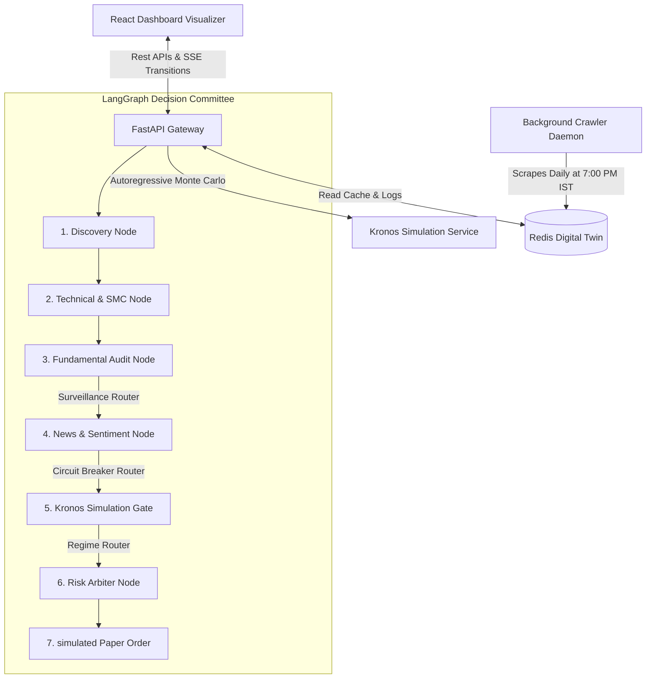

# Echo: Multi-Agent Investment Committee & Screener for Indian Equities

Echo is an institutional-grade, automated stock screening and real-time risk visualization platform designed specifically for the Indian Equity Markets (BSE/NSE). 

Echo merges **Warren Buffett / Benjamin Graham Value & Moat Quality** fundamentals with **Stan Weinstein / William O'Neil Breakout Momentum** and **Wyckoff / Smart Money Concepts (SMC)** structural price sweeps. Orchestrated with **LangGraph**, it runs a background crawler that caches candidate states in a Redis Digital Twin, serving a high-fidelity Bloomberg-style dashboard with beginner-friendly tooltips and entry timing assessments.

---

## 1. System Architecture & Flow

Echo utilizes a multi-layered, asynchronous intelligence pipeline:

---

## 2. Exhaustive Indicator Index & Formulae

### A. Warren Buffett Moat & Quality Indicators
Echo implements fundamental screening metrics to verify the operational resilience and pricing power of compounders:
1. **ROCE (Return on Capital Employed)**:
   $$\text{ROCE} = \frac{\text{EBIT}}{\text{Total Assets} - \text{Current Liabilities}}$$
   *Standard:* $\ge 15\%$ average over 3 years. Verifies high pricing power (Moat).
2. **ROE (Return on Equity)**:
   $$\text{ROE} = \frac{\text{Net Income}}{\text{Shareholders' Equity}}$$
   *Standard:* $\ge 15\%$. Evaluates efficiency in compounding shareholder capital.
3. **Cash Flow Integrity Ratio**:
   $$\text{Integrity} = \frac{\text{Cash Flow from Operations (CFO)}}{\text{Net Income}}$$
   *Standard:* $\ge 1.0$. Confirms that reported net profit is fully backed by operating cash, detecting accounting manipulation.
4. **Debt-to-Equity (D/E)**:
   $$\text{D/E} = \frac{\text{Total Liabilities}}{\text{Shareholders' Equity}}$$
   *Standard:* $<0.5$ (excluding banks and NBFCs) to protect capital during high-interest repo rate cycles.
5. **Operating Margin Stability (Moat Rating)**:
   Calculates the standard deviation of EBITDA margins over a 5-year period. A low standard deviation indicates a stable business moat with predictable pricing power.

### B. Benjamin Graham Valuation & Margin of Safety
Calculates the asset's intrinsic value using Benjamin Graham's revised formulation:
$$V^* = \frac{\text{EPS} \times (8.5 + 2g) \times 4.4}{Y}$$
*   **EPS**: Trailing Twelve Months (TTM) Earnings Per Share.
*   **g**: Expected earnings growth rate over 5 years.
*   **Y**: Yield on AAA corporate bonds in India (set to a conservative baseline of $7.5\%$).
*   **Margin of Safety**:
    $$\text{Margin of Safety} = \frac{V^* - \text{Current Price}}{V^*}$$
    Echo flags an asset as **Undervalued** if the Margin of Safety is $\ge 30\%$.

### C. Stan Weinstein & William O'Neil (CAN SLIM) Trend Models
1. **Weinstein Stage Analysis**:
   *   **Stage 1 (Accumulation)**: Price consolidates around a flat 150-day Simple Moving Average (SMA).
   *   **Stage 2 (Markup/Uptrend)**: Price breaks out above a rising 150-day SMA, supported by expanding volume.
   *   **Stage 3 (Distribution)**: Price fluctuates in a broad range as the 150-day SMA flattens.
   *   **Stage 4 (Markdown/Downtrend)**: Price declines below a sloping downwards 150-day SMA.
2. **Uptrend Score**: Evaluates if the price is above the 150-day SMA, the SMA slope is positive, and the price is within $10\%$ of its 52-week high.
3. **CAN SLIM Technical Score**: Evaluates volume accumulation (up-volume exceeds down-volume over the last 20 sessions), relative strength outperforming Nifty 50, and institutional held percentage.

### D. Wyckoff & Smart Money Concepts (SMC)
1. **Swing Pivots**: Detects swing highs and swing lows using a 5-candle fractal window.
2. **Liquidity Sweeps**:
   *   **Sellside Sweep**: Price wick pierces below a previous swing low to grab stop-loss liquidity, but the candle close remains above the support level (signaling institutional accumulation).
   *   **Buyside Sweep**: Price wick breaks above a previous swing high but closes back below it (signaling retail trap distribution).
3. **Displacement Candles**: Identifies strong institutional intent candles where the body size (Close - Open) is $\ge 1.2\times$ the 20-candle average.
4. **Fair Value Gaps (FVG)**: Shaded imbalance zones left behind by displacement candles (`Low(t) > High(t-2)` for bullish or `High(t) < Low(t-2)` for bearish).

### E. News, Sentiment, and Transcript Disclosures
1. **Local Gemma News Sentiment**: Scrapes headlines from RSS feeds (Yahoo Finance) and parses positive, negative, and neutral sentiment ratios using a local Gemma-4 LLM runner.
2. **Unscripted Q&A Sentiment Divergence**:
   $$\text{Divergence} = \text{Prepared Remarks Sentiment} - \text{Analyst Q\&A Sentiment}$$
   High divergence ($>0.35$) flags that management is evasive or hiding operational headwinds during unscripted analyst probing, calculated by local LLM semantic transcript parsing.

### F. Order Book Surveillance (Level 2/3)
1. **Weighted Order Flow Imbalance (WOFI)**:
   Calculates buy-wall vs. sell-wall imbalances, weighting limit orders inversely proportional to their distance from the Last Traded Price (LTP).

---

## 3. Thematic Catalyst & Supply Chain Arbitrage Engine

To go beyond static screens, Echo features a dynamic **Thematic Catalyst & Supply Chain Arbitrage** pipeline:

1. **Catalyst Ingestion (NLP)**: Accept unstructured policy documents, DAC clearances, or budget announcements. A local Gemma-4 LLM automatically extracts key themes (`DEFENSE`, `RAILWAYS`, `RENEWABLE_ENERGY`, `SEMICONDUCTORS`, or `OTHER`) and allocated budgets.
2. **Knowledge Graph Mapping**: Maps the detected theme to listed Indian monopolies/duopolies providing raw materials or components (e.g., Solar Industries for propellants; MIDHANI for aerospace alloys; Titagarh Rail for passenger trainsets; Borosil Renewables for solar glass).
3. **Smart Money Verification (OBV)**: Calculates the **On-Balance Volume (OBV)** and its 20-day EMA to verify if institutions are quietly accumulating shares.
   $$\text{OBV}_t = \text{OBV}_{t-1} + \text{Volume}_t \quad (\text{if } \text{Close}_t > \text{Close}_{t-1})$$
4. **Catalyst Exhaustion Filter (Risk)**: Checks if a stock has rallied more than $50\%$ in the last 90 trading days. If overextended, it issues a **"Do Not Buy - Catalyst Exhausted"** warning to prevent buying at distribution tops.

---

## 4. SEBI 2026 Algorithmic Framework Compliance

To remain legally deployable on Indian broker APIs, Echo enforces strict compliance parameters:
*   **The 10 OPS Rate Limiter**: Throttles order placement under 9 Orders Per Second (OPS) to prevent High-Frequency Trading (HFT) classification.
*   **Market Price Protection (MPP)**: Blocks naked market orders and automatically rewrites them as limit orders with a $\pm 1.5\%$ buffer offset to eliminate slippage during flash crashes.
*   **Surveillance Watchlists (ASM/GSM)**: Dynamic Playwright crawler automatically scrapes SEBI's Additional Surveillance Measure (ASM), Graded Surveillance Measure (GSM), and Trade-to-Trade (T2T) lists from the official NSE website every evening.

---

## 5. LangGraph Decision Committee Nodes

When a ticker is submitted for deep audit, the LangGraph orchestrator steps through these specialized desks:
1. **`discovery` (Discovery Desk)**: Loads the ticker profile and checks sector benchmarks.
2. **`technical_analysis` (Technical Desk)**: Calculates Weinstein stages, CAN SLIM ratings, sweeps, and active FVGs.
3. **`fundamental_evaluation` (Fundamental Desk)**: Calculates Buffett ROCE/integrity, Graham values, and checks SEBI ASM/GSM watchlists. If blocked by surveillance, it routes to `abort_trade`.
4. **`sentiment_validation` (Sentiment Desk)**: Scrapes news and earnings call transcripts, computing Q&A sentiment divergence using local Gemma-4. If divergence is excessive or news is highly negative, it routes to `abort_trade`.
5. **`simulation_gate` (Simulation Desk)**: Quantizes historical OHLCV data and runs a 24-step Monte Carlo autoregressive projection using the local **Kronos** model.
6. **`risk_arbiter` (Risk Desk)**: Calculates optimal position size (scaled up to $2.0\%$ of capital based on Kronos success probability), verifies SEBI compliance headers, and routes a paper trade execution.

---

## 6. Model Execution & Build System Optimization

To keep infrastructure cost at zero and preserve data privacy, Echo performs all LLM inference locally:
* **Gemma-4 GGUF**: Runs the `google_gemma-4-E4B-it-Q4_K_M.gguf` model locally inside the Docker container via `llama-cpp-python`.
* **Zero Cold-Start Latency**: The GGUF model is pre-downloaded from Hugging Face Hub during the Docker build stage.
* **OOM Compiler Protection**: Compilation thread limits (`CMAKE_BUILD_PARALLEL_LEVEL=1`) and thread pool restrictions are enforced in the Dockerfile to prevent container memory limit shutdowns (Exit 137).
* **Unsafe Best Match Index**: Utilizes a `[tool.uv]` config to resolve dependency wheels from PyPI and the `llama-cpp-python` CPU-only wheels index, ensuring compilation is avoided where possible.

---

## 7. Next-Gen Dashboard Interface Features

*   **Timing Assessment Card**: Beginner-friendly badge advising on entry risk (Optimal Buy, Accumulation, Train Has Left, or Avoid).
*   **Glossary Help Tooltips**: Hovering over scorecard metrics displays explanations of the formulas and target thresholds.
*   **Dual Chart Layout**: Displays historical closing prices overlaid with SMA support floors alongside Kronos Monte Carlo projection bands.
*   **Live Reasoning Terminal**: Streaming node logs via Server-Sent Events (SSE) reflecting the active thoughts of the Investment Committee.
