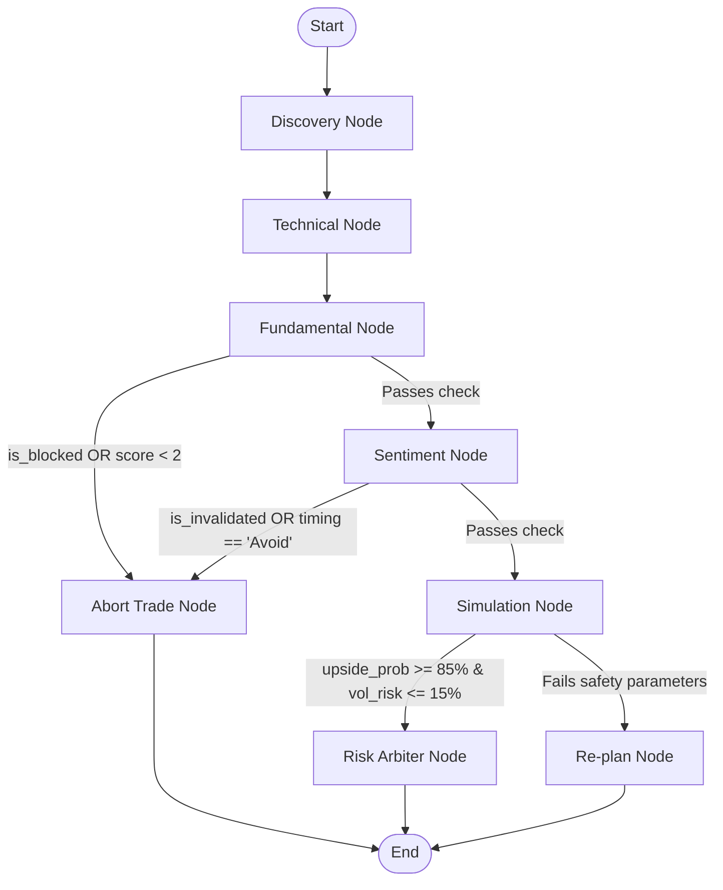

# Echo: Comprehensive Features, Practical Implementation Mechanics, and Architectural Drawbacks

Echo is an automated stock screening and real-time risk visualization platform designed specifically for the Indian Equity Markets (BSE/NSE). The application combines Warren Buffett quality metrics, Benjamin Graham intrinsic value, Stan Weinstein stage analysis, Smart Money Concepts (SMC) order book dynamics, and a local autoregressive transformer simulation (Kronos) into a multi-agent decision graph orchestrated by LangGraph.

This document provides a master-level, detailed breakdown of all features, their programmatic implementations, and both their **technical** and **practical/real-world market** drawbacks.

---

## Table of Contents
1. [Multi-Agent Investment Committee Graph (`investment_committee.py` & `state.py`)](#1-multi-agent-investment-committee-graph)
2. [Local LLM Gateway (`llm_gateway.py`)](#2-local-llm-gateway)
3. [Persistent & Self-Updating Thematic Engine (`thematic_engine.py` & `thematic_db.py`)](#3-persistent--self-updating-thematic-engine)
4. [Playwright Compliance & Flows Crawler (`screener_daemon.py`)](#4-playwright-compliance--flows-crawler)
5. [SEBI Algorithmic Compliance Gates (`surveillance_compliance.py`)](#5-sebi-algorithmic-compliance-gates)
6. [Technical Trend & Structural Models (`trend_models.py`)](#6-technical-trend--structural-models)
7. [Warren Buffett & Benjamin Graham Valuation Models (`valuation_models.py`)](#7-warren-buffett--benjamin-graham-valuation-models)
8. [Autoregressive Kronos Simulation Service (`kronos_brain.py` & `kronos_api.py`)](#8-autoregressive-kronos-simulation-service)

---

## 1. Multi-Agent Investment Committee Graph
### File Architecture
* **Implementation File**: [investment_committee.py](file:///Users/amitkumardey/Workspace/Projects/Echo/backend/agents/investment_committee.py)
* **State Definition**: [state.py](file:///Users/amitkumardey/Workspace/Projects/Echo/backend/agents/state.py)

### Feature Overview
Coordinates the different specialized analytical desks (Discovery, Technical, Fundamental, Sentiment, Simulation, Risk) into a structured LangGraph state machine. It handles ticker evaluation sequentially, routing candidates through compliance, validation, and simulation checks, culminating in simulated order sizing or rejection.



### Technical Implementation Details
* **Graph Definition**: Uses `langgraph.graph.StateGraph(CommitteeState)` to build the state transition topology.
* **Nodes**:
  1. `discovery`: Resolves the ticker, pulls cached candidate data, and fetches market-wide FII/DII flow statistics from Redis.
  2. `technical_analysis`: Scrapes/calculates swing structures, Weinstein trends, and timing assessments.
  3. `fundamental_evaluation`: Audits financials, Buffett scorecard, and regulatory compliance flags.
  4. `sentiment_validation`: Scrapes news headlines, runs FinBERT/LLM evaluations, and reads earnings call transcripts to check prepared vs. unscripted analyst Q&A sentiment divergence.
  5. `simulation_gate`: Dispatches historical price sequences to the Kronos simulation service.
  6. `risk_arbiter`: Computes order book imbalances (WOFI), calculates virtual position sizing, and determines stop-loss boundaries.
  8. `abort_trade` / `re_plan`: Terminal fallback nodes invoked when safety filters fail.
* **Conditional Routing**: 
  - `route_after_fundamental`: Aborts if the ticker is blacklisted by SEBI surveillance or has a fundamental score $< 2$.
  - `route_after_sentiment`: Aborts if news is manic, panic-driven, or unscripted Q&A sentiment shows high evasion.
  - `route_after_simulation`: Routes to `risk_arbiter` if the Kronos simulated upside probability is $\ge 85\%$ and volatility risk is $\le 15\%$, else routes to `re_plan`.
* **Sizing Calculation**: Implements a Kelly-inspired allocation formula capping virtual capital deployment at 2% per position:
  $$\text{Allocation \%} = \text{upside\_probability} \times 0.02$$

### Drawbacks & Limitations
#### Technical Drawbacks
* **Latency Bottleneck**: Because nodes are executed sequentially and interface with multiple disk/network resources (Redis, yfinance, local LLM gateway, SQLite), running a single ticker analysis takes 5 to 15 seconds. It cannot be used for real-time intra-day scanning across hundreds of stocks.
* **Purely Sequential Logic**: It lacks the ability to run independent desks (e.g., technical and fundamental) in parallel branches, which limits throughput.

#### Practical & Market Drawbacks
* **Naive Sizing and Concentration Risk**: The allocation formula ($\text{upside\_probability} \times 0.02$) is applied per-ticker in a vacuum. If a major policy catalyst (e.g., a massive railway expansion budget) triggers positive signals across 15 different railway stocks, the graph will recommend maximum allocation to all 15. The portfolio will end up highly concentrated in a single sector, exposing the user to sector-wide corrections and correlation risk.
* **Static Execution State**: The state machine operates as a "one-shot" batch evaluator. It cannot handle dynamic changes in market conditions during execution (e.g., a stock hitting its daily lower circuit limit mid-session).

---

## 2. Local LLM Gateway
### File Architecture
* **Implementation File**: [llm_gateway.py](file:///Users/amitkumardey/Workspace/Projects/Echo/backend/services/llm_gateway.py)

### Feature Overview
Provides local natural language processing capabilities. It runs entirely on the host CPU/GPU, eliminating reliance on external cloud APIs (e.g., OpenAI or Gemini), ensuring zero-cost operation and absolute data privacy.

### Technical Implementation Details
* **Engine Integration**: Implements a `LocalLLMEngine` that lazy-loads a quantized Instruct model (`google_gemma-4-E4B-it-Q4_K_M.gguf`) via the `llama-cpp-python` bindings.
* **Non-Blocking Execution**: Wraps the inference blocking calls inside a Python `ThreadPoolExecutor` and uses:
  ```python
  asyncio.get_event_loop().run_in_executor(None, lambda: self.llm(...))
  ```
  This keeps the main FastAPI async loop fully responsive during heavy CPU-bound token generation.
* **Gemma Turn Formatting**: Wraps incoming user and system system instructions inside standard turn delimiters:
  ```text
  <|turn>system
  {system_instruction} <turn|>
  <|turn>user
  {prompt} <turn|>
  <|turn>model
  ```
* **Thought Stripping**: Uses regular expressions to match and strip out the internal `<|channel>thought...<channel|>` reasoning blocks before returning the payload to the calling service:
  ```python
  cleaned = re.sub(r'<\|channel>thought.*?<channel\|>', '', text, flags=re.DOTALL)
  ```

### Drawbacks & Limitations
#### Technical Drawbacks
* **High CPU Utilization & Latency**: Running GGUF models on CPU cores is extremely slow. A single extraction request can take between 3 to 8 seconds depending on context length, leading to severe latency bottlenecks.
* **Quantization Degradation**: Quantizing the model to 4-bit (`Q4_K_M`) reduces memory footprint to under 3GB but degrades language comprehension, leading to parsing errors in complex structured JSON outputs.

#### Practical & Market Drawbacks
* **Parsing Failure under Market stress**: During high-volume market events, multiple news articles and filings hit the gateway. The small 4-bit model's tendency to output malformed JSON strings under complex scenarios means the parser frequently fails, resulting in the system missing critical news catalysts or falling back to simple keyword matching.
* **Inability to Analyze Large Transcripts**: Earnings call transcripts frequently exceed 20,000 words. Quantized local models lack the long-context coherence required to analyze these documents, causing them to hallucinate sentiment scores or ignore crucial disclosures hidden in the text.

---

## 3. Persistent & Self-Updating Thematic Engine
### File Architecture
* **Implementation Files**: [thematic_engine.py](file:///Users/amitkumardey/Workspace/Projects/Echo/backend/services/thematic_engine.py), [thematic_db.py](file:///Users/amitkumardey/Workspace/Projects/Echo/backend/services/thematic_db.py)

### Feature Overview
Maps top-down policy announcements or corporate contract wins to supply chain suppliers in the Indian market. It evaluates if the stock is being accumulated by institutional capital (On-Balance Volume check) and filters out overextended plays that are nearing distribution.

### Technical Implementation Details
* **SQLite Graph Database**: Persists relations in `thematic_knowledge_graph.db` with a structured node-edge schema:
  - `nodes`: Store `id` (e.g. `"BEL.NS"`, `"DEFENSE"`), `type` (`"COMPANY"`, `"THEME"`), `label`, and `description`.
  - `edges`: Capture relationships with attributes: `source_id`, `target_id`, `relation_type` (e.g. `"SUPPLIES_SECTOR"`, `"CONTRACT_WIN"`), `weight` (budget value in crores), `pricing_power` (e.g. monopoly/duopoly), `catalyst_relevance`, and `timestamp`.
  - Enforces `PRAGMA foreign_keys = ON;` and `ON DELETE CASCADE` to guarantee clean relational deletions.
* **Autonomous RSS News Crawler**: Periodically fetches Google News RSS query streams searching moneycontrol.com and economictimes.indiatimes.com for keywords like `order win` or `secures contract`. Uses Gemma-4 to parse raw headlines into structured JSON entities:
  ```json
  {"is_order_win": true, "company_name": "...", "theme": "...", "products_or_materials": [...], "estimated_budget_cr": ...}
  ```
* **Company Ticker Resolver**: Cleans raw company names (removing corporate suffixes like "Ltd", "Limited") and matches them against the dynamic Nifty 500 constituents database using token intersection and length ratios. It automatically inserts successful mappings as new graph nodes and edges.
* **Catalyst Forgetting (TTL)**: Automatically hard-prunes expired short-term catalyst edges to keep the graph relevant:
  ```sql
  DELETE FROM edges WHERE relation_type = 'CONTRACT_WIN' AND timestamp < (current_time - 180 days)
  ```
* **Data Anomaly Sanitization**: Enforces strict sanity checks:
  1. Ignores close prices $\le 0$.
  2. Discards sequences showing sudden price spikes $> 100\%$ day-on-day.
  3. Audits volume data and logs anomalies if active trading days record 0 volume.
* **Smart Money Verification**: Calculates On-Balance Volume (OBV) and its 20-day EMA:
  $$\text{OBV}_t = \text{OBV}_{t-1} + \text{Volume}_t \times \text{sign}(\text{Close}_t - \text{Close}_{t-1})$$
  Institutional accumulation is confirmed only if $\text{OBV} > \text{OBV\_EMA20}$ and the OBV is rising over a 10-day rolling window.
* **Catalyst Exhaustion Filter**: Flags a stock as **"Do Not Buy - Catalyst Exhausted"** if it has rallied $\ge 50\%$ in the last 90 trading days. This prevents retail traders from buying at the top of a distribution phase when insiders dump shares.
* **Contract Impact Ratio**: Computes the percentage impact of the contract win value relative to the company's total market capitalization:
  $$\text{Impact \%} = \frac{\text{Budget in Crores}}{\text{Market Cap in Crores}} \times 100$$

### Drawbacks & Limitations
#### Technical Drawbacks
* **Name Resolution Failures**: The company name resolver relies on token overlaps and string similarity. It can fail or misresolve when news articles use informal short names (e.g., "Premier Exp" instead of "Premier Explosives"), creating incorrect edges in the database.
* **Arbitrary TTL Pruning**: The 180-day expiry for contract wins is static. Long-term multi-year infrastructure or defense contracts, which materially impact earnings for 2-5 years, are pruned at the same rate as small, short-term orders.

#### Practical & Market Drawbacks
* **Relational SQLite Graph Limitations vs. Native Graph DBs**:
  - The thematic engine uses a standard relational database (`SQLite`) structured with `nodes` and `edges` tables. It executes queries using standard SQL `JOIN` statements.
  - *No Multi-Hop Capability*: In supply chain arbitrage, the true opportunity often lies in indirect relationships (e.g., government increases defense budget $\to$ buys missiles from Bharat Dynamics $\to$ who buys rocket motors from Premier Explosives $\to$ who buys raw chemical inputs from a smaller chemical manufacturer).
  - *Join Explosion*: Querying these multi-hop relationships in SQLite requires recursive Common Table Expressions (CTEs) or multiple nested `JOIN` operations. This is computationally expensive, prone to query lockups, and highly complex to write.
  - *The Native Alternative*: A native graph database (such as Neo4j or Memgraph) uses index-free adjacency. It can traverse deep supply chain paths (5+ hops) in microseconds, allowing the screener to trace the cash injection down to secondary and tertiary suppliers who are often unrecognized by the broader market.
* **Static Exhaustion Threshold**: The 50% run-up filter in 90 days applies uniformly. It doesn't adjust for high-beta micro-caps (where 50% swings are common) vs. low-beta large-caps (where a 50% rally signals institutional re-rating).

---

## 4. Playwright Compliance & Flows Crawler
### File Architecture
* **Implementation File**: [screener_daemon.py](file:///Users/amitkumardey/Workspace/Projects/Echo/backend/services/screener_daemon.py)

### Feature Overview
Automates browser actions using Playwright to scrape SEBI surveillance lists directly from the National Stock Exchange (NSE) and fetch institutional daily buying/selling flows from financial portals, bypassing Cloudflare protections.

### Technical Implementation Details
* **Headless Browser Automation**: Launches a Chromium instance using Playwright, rotates standard user-agent strings, sets default viewports, and navigates to target pages.
* **NSE Surveillance Scraper**: Navigates to `nseindia.com` first to store session cookies, then accesses the surveillance measure page (`/reports/adr-res-surveillance-measure`). It parses active tables, maps table header indices semantically, and extracts stock symbols listed under ASM, GSM, and Trade-to-Trade (T2T) categories.
* **Institutional Flow Scraper**: Navigates sequentially to NiftyTrader, Moneycontrol, and StockEdge to scrape cash segment FII/DII activities.
* **Semantic Table Parsing**: Uses a JavaScript page evaluation function to scan table rows. It parses columns based on semantic text matches (e.g., "fii", "dii", "net", "value"), cleans string characters, and converts accounting negative structures like `(1,234.50)` into a valid negative float `-1234.50`.
* **Rolling Historical Cache**: Caches the last 5 days of FII/DII flows in Redis to compute a rolling 5-day flow average, determining if the overall market is in a "Net Accumulation" or "Net Distribution" state.

### Drawbacks & Limitations
#### Technical Drawbacks
* **Heavy Memory Overhead**: Running headless Chromium via Playwright requires significant RAM and CPU. On lightweight cloud instances (like Hugging Face Spaces basic CPU tiers), launching Chromium frequently triggers Out-of-Memory (OOM) errors, killing the background worker.
* **Brittle DOM Selectors**: The scrapers rely on finding HTML table rows and columns. If any target website redesigns its layout or changes CSS class names, the scraper will fail, returning empty results.

#### Practical & Market Drawbacks
* **IP Blocking & Cloudflare Friction**: The NSE website utilizes advanced Web Application Firewalls (WAF) and Cloudflare protection. Scraping frequently from cloud IPs quickly triggers blocks, requiring CAPTCHA resolution or proxy rotations.
* **Latency Gap in Daily Flows**: FII/DII daily flow data is only published after the market close (typically around 6:30 PM IST). A system relying on these scraped stats cannot dynamically react to institutional selling cascades *during* the trading day, leaving it exposed to sharp intraday trend reversals.

---

## 5. SEBI Algorithmic Compliance Gates
### File Architecture
* **Implementation File**: [surveillance_compliance.py](file:///Users/amitkumardey/Workspace/Projects/Echo/backend/services/surveillance_compliance.py)

### Feature Overview
Enforces regulatory compliance guardrails mandated by SEBI's algorithmic trading frameworks, protecting automated capital from HFT penalties, high slippage, and trading restrictions.

### Technical Implementation Details
* **Leaky-Bucket Rate Limiter**: Implements a token-bucket algorithm that limits order execution rates to under 9 Orders Per Second (OPS) to prevent the account from being classified as High-Frequency Trading (HFT):
  ```python
  self.tokens = min(self.capacity, self.tokens + elapsed * self.capacity)
  ```
* **Surveillance Filtration**: Filters out and blocks trading on symbols active in ASM, GSM, or T2T segments. It logs warning details explaining compliance margin requirements (e.g., "100% upfront margin required").
* **Market Price Protection (MPP)**: Strictly intercepts naked market orders (`ORDER_TYPE_MARKET`) and converts them to limit orders placed at a buffer boundary relative to the Last Traded Price (LTP).
  - *MPP Calculation*: Adds a 1.5% buffer for Buy orders and subtracts 1.5% for Sell orders.
  - *Indian Tick Rounding*: Programmatically rounds the calculated limit price to the nearest standard Indian tick size of 5 paise (₹0.05):
    ```python
    tick_size = 0.05
    limit_price = round(round(limit_price / tick_size) * tick_size, 2)
    ```
* **Strategy Audit Tagging**: Inject unique algorithm strategy tags (`algo_id = "ECHO_ALGO_2026"`) and audit timestamps into all order payloads to comply with regulatory tracking requirements.

### Drawbacks & Limitations
#### Technical Drawbacks
* **Execution Latency**: The rate-limiter introduces latency by queuing orders when the 9 OPS threshold is hit. In fast-moving breakouts, this delay can result in missing the optimal entry price.
* **Static Buffer Risk**: The 1.5% MPP buffer is static. During extreme market-wide panic or flash crashes, a 1.5% limit offset might not be hit, causing the order to remain unexecuted while the price moves away.

#### Practical & Market Drawbacks
* **The Whitelisted IP Trap**: Under SEBI's algo rules, orders must originate from a dedicated, static IP registered with the broker. Standard cloud hosting solutions (like AWS ECS or Heroku/Hugging Face containers) dynamically recycle container instances, changing outbound IPs. If the container restarts during a session, the outbound IP changes, causing the broker's system to immediately reject all orders, disabling execution.
* **The Delivery-Only (T2T) Trap**: If the surveillance scraper fails to identify that a stock has been moved to the Trade-to-Trade (T2T) list (due to a scrape timeout or layout change), the system might attempt to execute a short-term intraday trade. On Indian exchanges, intraday netting is prohibited for T2T stocks. The trade will be forced into physical delivery settlement, locking up substantial capital and incurring auction penalties.

---

## 6. Technical Trend & Structural Models
### File Architecture
* **Implementation File**: [trend_models.py](file:///Users/amitkumardey/Workspace/Projects/Echo/backend/services/trend_models.py)

### Feature Overview
Calculates structural price action features and identifies key levels of institutional interest. It combines Stan Weinstein's stage theory, William O'Neil's CANSLIM momentum, and Smart Money Concepts (SMC) to determine entry timing.

### Technical Implementation Details
* **Weinstein Stage Analysis**: Uses a 150-day SMA (representing the 30-week institutional line) and evaluates trends:
  - **Stage 1 (Accumulation)**: Price consolidates around a flat 150-day SMA (slope between $\pm 0.05\%$).
  - **Stage 2 (Markup)**: Price breaks out above a rising 150-day SMA (slope $> 0.05\%$) supported by high volume ($> 1.5\text{x}$ average volume).
  - **Stage 3 (Distribution)**: Price consolidates or chops around a flattening 150-day SMA.
  - **Stage 4 (Markdown)**: Price falls below a declining 150-day SMA (slope $< -0.05\%$).
* **Fair Value Gaps (FVG) Detection**: Programmatically scans for 3-candle imbalances:
  - *Bullish FVG*: $\text{Low}_t > \text{High}_{t-2}$. The gap is the zone between these two prices.
  - *Bearish FVG*: $\text{High}_t < \text{Low}_{t-2}$.
  - Tracks mitigation by checking if any subsequent candle's price range overlaps and fills the gap.
* **SMC Liquidity Sweeps**: Identifies swing highs and swing lows using a rolling window. If the current candle's wick pierces a prior swing high/low (within the past 50 candles) but the body closes back within the range, the model flags a liquidity sweep (stop-loss hunt).
* **CANSLIM Scoring**: Implements technical checks for William O'Neil's growth model:
  - **N (New High)**: Price is within 15% of its 52-week high.
  - **S (Supply/Demand)**: Up-day volume exceeds down-day volume over a 20-day period.
  - **L (Leader)**: Outperforms the market (6-month performance $\ge 20\%$).
  - **I (Institutional)**: Institutional holding $\ge 5\%$ (fetched from yfinance).
  - **M (Market)**: Price is above the 150-day SMA.
* **Beginner Entry Timing**: Maps technical outputs to entry categories:
  - `"Optimal Buy"`: Fresh Stage 2 breakout within 7% of the 150-day SMA.
  - `"Train Has Left"`: Stage 2 markup but trading $> 15\%$ above the 150-day SMA.
  - `"Accumulation"`: Stage 1 consolidation (safe but slow).
  - `"Avoid"`: Stage 3 or Stage 4 downward trends.

### Drawbacks & Limitations
#### Technical Drawbacks
* **Lagging Indicators**: Moving averages are lagging calculations. In highly volatile Indian mid-cap stocks, a stock can rally 30% to 50% before the 150-day SMA slope turns positive and triggers a Stage 2 classification.
* **Wick Sensitivity**: Swing sweep identification is highly sensitive to the chosen local window (default is 5 candles). Small windows identify minor consolidation noise as key liquidity zones, leading to false sweep signals.

#### Practical & Market Drawbacks
* **The "L2 Depth required" Iceberg/Spoofing Paradox**:
  - The risk arbiter code contains functions to analyze Level 2 depth (order books, bid/ask details) and detect hidden iceberg accumulation or institutional spoofing.
  - *No Live Data Stream*: In the actual implementation, the L2 data structures are hardcoded to `False` or empty arrays because standard free APIs (like `yfinance`) only expose Level 1 data (LTP and basic bid/ask size).
  - *Practical Impossibility*: Without a premium, low-latency market data connection (such as TrueData, Interactive Brokers, or Kite Connect API), these advanced order book algorithms are completely non-functional.
* **The "Trap Door" of False Breakouts**: Weinstein's Stage 2 breakout signal is highly profitable in a structural bull market. However, in a choppy, sideways market, the screener will flag "Stage 2 Breakouts" at the top of a range, only for the price to instantly mean-revert, trapping capital in losing positions.

---

## 7. Warren Buffett & Benjamin Graham Valuation Models
### File Architecture
* **Implementation File**: [valuation_models.py](file:///Users/amitkumardey/Workspace/Projects/Echo/backend/services/valuation_models.py)

### Feature Overview
Filters out companies lacking capital efficiency, high margins, or financial integrity. It calculates a company's quality score and determines its margin of safety using classic value investing formulas.

### Technical Implementation Details
* **Statement Parsing**: Extract 3-year historical financial metrics from financial statements:
  - **EBIT**: Extracted from Income Statement or operating margins.
  - **Capital Employed**: Calculated as $\text{Total Assets} - \text{Current Liabilities}$.
  - **ROCE**: computed as:
    $$\text{ROCE} = \frac{\text{EBIT}}{\text{Capital Employed}}$$
  - **ROE**: $\frac{\text{Net Income}}{\text{Shareholders Equity}}$.
  - **Cash Integrity**: Measures cash flow quality:
    $$\text{Cash Integrity Ratio} = \frac{\text{Operating Cash Flow (CFO)}}{\text{Net Income}}$$
* **Buffett Scorecard**: Evaluates 5 core quality checks:
  1. ROCE $\ge 15\%$
  2. ROE $\ge 15\%$
  3. Operating Margin $\ge 15\%$
  4. Debt-to-Equity $\le 0.5$
  5. Cash Integrity Ratio $\ge 1.0\text{x}$ (checks if net profit is backed by real operating cash).
* **Benjamin Graham Intrinsic Value**: Calculates value using the revised Graham formula:
  $$V^* = \frac{\text{EPS} \times (8.5 + 2g) \times 4.4}{Y}$$
  - $g$: Expected 5-year earnings growth rate.
  - $Y$: AAA corporate bond yield in India, set to a default of $7.5\%$.
* **Margin of Safety**: Determines if the stock is undervalued:
  $$\text{Margin of Safety (MOS)} = \frac{V^* - \text{Price}}{V^*}$$
  A stock is flagged as undervalued if the $\text{MOS} \ge 30\%$.

### Drawbacks & Limitations
#### Technical Drawbacks
* **Statement Scraper Dependency**: The engine requires complete 3-year statement histories. If Yahoo Finance returns incomplete dataframes (a common occurrence for Indian ADRs and mid-caps), the engine falls back to basic `info` dict metrics, disabling the multi-year average and standard deviation checks.
* **Static Bond Yield**: The Indian AAA bond yield is hardcoded to $7.5\%$. In reality, interest rates fluctuate based on RBI repo rate revisions.

#### Practical & Market Drawbacks
* **The PSU Cyclical Value Trap**:
  - The core thematic focus of the application is mapping capex catalysts (defense budgets, railway modernization) to listed Indian stocks. Most of these monopolies/duopolies are Public Sector Undertakings (PSUs) or cyclical heavy-industry giants (e.g., RVNL, IRCON, BEML, HAL).
  - *Cyclical Peak Pricing*: Graham's formula and the Buffett scorecard evaluate backward-looking trailing EPS. At the peak of a capex cycle, these companies report record-high earnings, making them look highly "undervalued" with massive margins of safety.
  - *The Trap*: In reality, capex ordering cycles are lumpy. Once the government allocations slow down, earnings drop rapidly. Buying at the peak of the earnings cycle based on backward-looking metrics results in entering the stock at the exact top of its valuation curve, trapping capital.
* **Static Growth Assumptions**: Assuming a static growth rate ($g$) over 5 years is unrealistic for mid-cap stocks, which frequently experience extreme changes in operational performance.

---

## 8. Autoregressive Kronos Simulation Service
### File Architecture
* **Implementation Files**: [kronos_brain.py](file:///Users/amitkumardey/Workspace/Projects/Echo/backend/services/kronos_brain.py), [kronos_api.py](file:///Users/amitkumardey/Workspace/Projects/Echo/backend/services/kronos_api.py)

### Feature Overview
Evaluates the probability of trend survival using a local neural time-series model. It simulates multiple future price paths using Monte Carlo rollouts to project whether the stock's momentum remains intact.

### Technical Implementation Details
* **Model Architecture**: Uses a fallback PyTorch model (`SimpleKronosModel`) mimicking a transformer encoder-decoder structure:
  - Input features: Open, High, Low, Close, Volume, Amount (6 dimensions).
  - Normalization: Quantizes inputs relative to the first candle of the sequence to ensure translation invariance.
* **Monte Carlo Rollouts**: Generates $N$ (default 30) independent prediction paths over a 24-step forward horizon.
* **Noise and Jitter**: Injects path variance during prediction steps using temperature-scaled Gaussian noise:
  $$\text{Noise} = \mathcal{N}(0, 1) \times (\text{temperature} \times 0.05)$$
* **Physical Constraints Enforcement**: Restructures the generated offsets at each step to maintain logical price constraints:
  $$\text{Low} \le \text{Close} \le \text{High} \quad \text{and} \quad \text{Low} \le \text{Open} \le \text{High}$$
* **Probability Metrics**:
  - **Upside Probability**: The percentage of paths where the final projected close price is higher than or equal to the starting close price.
  - **Volatility Amplification**: The standard deviation of the final close prices normalized by the starting close price.
  - **Safety Gate**: Recommends a buy only if $\text{Upside Probability} \ge 85\%$ and $\text{Volatility Amplification} \le 15\%$.

### Drawbacks & Limitations
#### Technical Drawbacks
* **Untrained Fallback Weights**: Since the foundation model weights (`shiyu-coder/kronos-base`) are not included in the default lightweight workspace distribution, the system initializes a `SimpleKronosModel` on the fly. The output paths represent randomized Gaussian walks rather than trained financial patterns.
* **Autoregressive Error Accumulation**: In autoregressive models, errors in step $t$ propagate and compound in subsequent steps. This makes predictions beyond a few steps highly speculative.

#### Practical & Market Drawbacks
* **Price Action is Not a Closed System**:
  - The model evaluates price patterns (OHLCVA) in isolation. However, stock prices are not driven by mathematical equations or closed-system physics.
  - *Exogenous Market Shocks*: An autoregressive simulation cannot foresee external events (such as corporate earnings announcements, index-level crashes, or global geopolitical developments).
  - *Risk of False Security*: Relying on a "90% simulated upside probability" generated by a price-only model can create a false sense of security, causing the user to bypass standard risk management controls (like hard stop-losses).

---

## Practical Architecture Matrix: Key System Trade-offs

| System Component | Practical Implementation | Real-world Market Drawback | Ideal/Correct Production Alternative |
| :--- | :--- | :--- | :--- |
| **Thematic Arbitrage** | SQLite tables with simple relationships and SQL `JOIN` queries. | Single-hop query limit. Misses indirect, secondary, and tertiary supply chains where actual arbitrage alpha exists. | A native graph database (like Neo4j or Memgraph) to map multi-hop relationships. |
| **Market Data Ingestion** | Dynamic `yfinance` fetches with randomized headers. | API rate-limiting, frequent blocks, and lack of real-time Level 2 depth for BSE/NSE stocks. | A direct, low-latency market data API subscription (e.g., Kite Connect or TrueData). |
| **Order Book Analysis** | Logic to analyze Iceberg and Spoofing patterns in code. | L2/L3 data fields are hardcoded to `False` or empty due to the lack of a live order book feed. | A direct Level 3 MBO feed from an institutional broker. |
| **Fundamental Audit** | Simple Graham formula and backward-looking Buffett scorecard. | Vulnerable to cyclical peaks (value traps) in heavy-capex PSU sectors (Defense/Railways). | Dynamic sector-specific models and forward earnings projections. |
| **Regulatory Compliance** | Leaky-bucket rate limiter and dynamic list scraper. | Risk of Dynamic cloud IP shifts on Hugging Face Spaces violating static registered IP policies. | Dedicated cloud instance with a whitelisted, static Elastic IP. |
| **Autoregressive Model** | local PyTorch model initialized on the fly. | The model operates on untrained weights, producing random-walk outputs. | A fully pre-trained model with regular training runs on historical NSE/BSE data. |
| **News Catalyst Processing** | Google News RSS crawler and local LLM extraction. | RSS feeds are heavily lagged, meaning news is already priced in by the time the crawler runs. | A direct real-time news API feed (e.g., Bloomberg or Reuters terminal API). |
